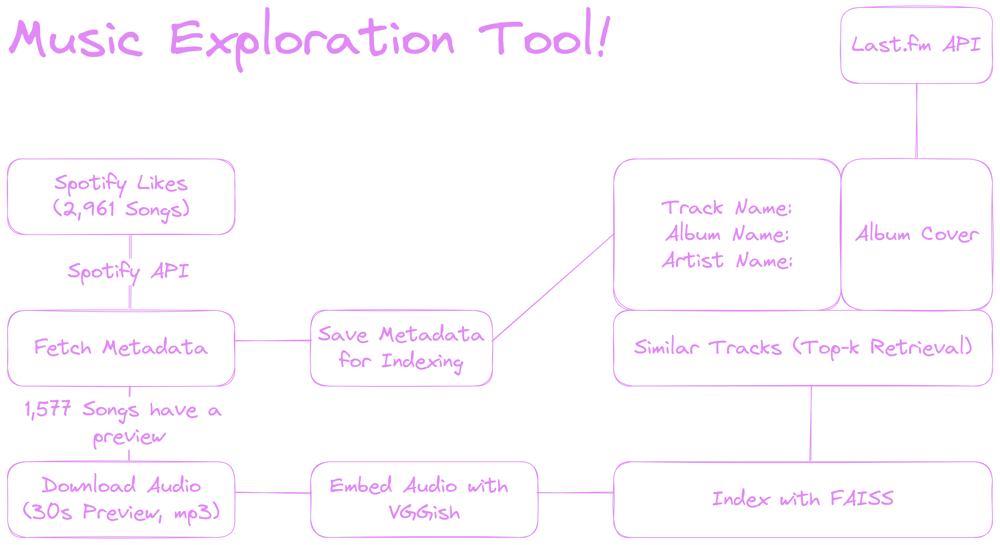

# Music Exploration Tool
This is a very simple UI I made for a music exploration tool as part of an ongoing saga to embed every possible data modality.

# Overview


# Usage
[](https://musicexplorationtool.streamlit.app/)

The app is live [here.](https://musicexplorationtool.streamlit.app/)

It has my own likes in it.

The app has a companion Nomic Atlas map to visualize the embeddings, you can find it [here](https://atlas.nomic.ai/data/tyqnology/likes-dump-mean-pooled-normalized-vggish/map)

# Local Setup
To embed your audio, you can use this repo which has a simple script to embed audio files using VGGish and Mean Pooling, you can find it [here](https://github.com/a-tabaza/audio_embeddings).

Export a .npy file with the embeddings, index them using faiss (I used a flat L2 index for this), save the index, export a metadata JSON file as well, mine has the following attributes per song:
```json
{
    "track_name": "Lail Wa Raed Wa Reeh",
    "artist_name": "Wael Kfoury", 
    "album_name": "Shafouha Wsaroo Yegolou", 
    "preview_url": "https://p.scdn.co/mp3-preview/70a7161502d42273676076c997bc3c3e8e4a872c?cid=1980af88f3594c5aa4198035b0957641", 
    "file_name": "0"
}
```
You can then use the app locally by changing the paths in the app.py file to your own embeddings and metadata.

To set up locally and use your own embeddings and likes, you can use the following commands:
```bash
git clone https://github.com/a-tabaza/music_exploration_tool
cd music_exploration_tool
python -m venv venv
source venv/bin/activate
pip install -r requirements.txt
pip install streamlit
streamlit run app.py
```

